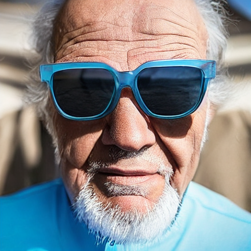

# Usage

```python
from text_to_2D.model import FaceControlNet
model = FaceControlNet(
    prior_sketch_path="text_to_2D/prior_sketches/mask.jpg",
    diffusion_model_name="runwayml/stable-diffusion-v1-5",
    controlnet_model_name="lllyasviel/control_v11p_sd15_openpose",
    negative_prompt="low resolution, nsfw, ugly, duplicate",
)

imgs = model(prompt=['russian grandpa with sunglasses'])
imgs[0].show()
```
